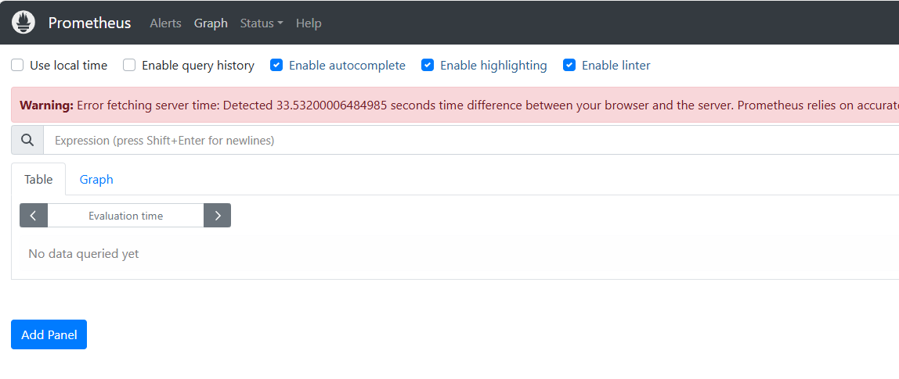
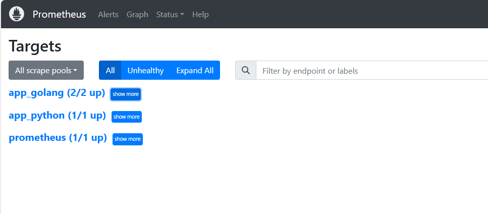
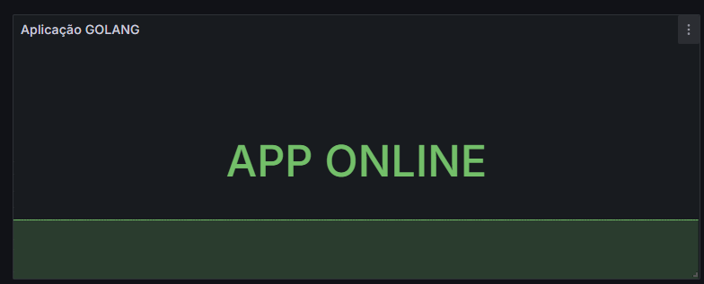
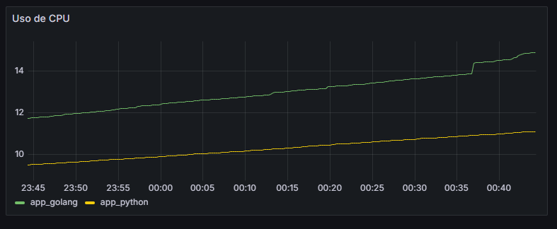
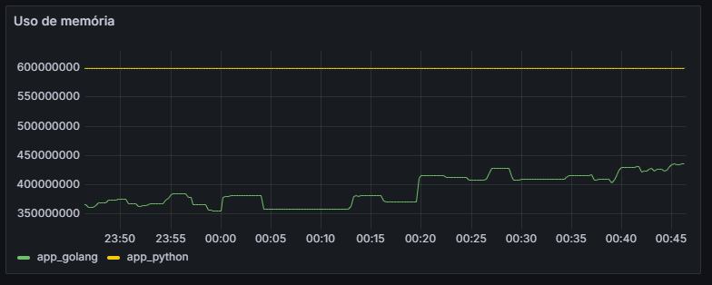

# Ambiente de testes com Grafana e Prometheus

### <br> Resumo do ambiente de testes 
 

O ambiente de testes é composto de acordo com as especificações abaixo: 

  * INSTANCIA AWS EC2 - 1

    *  Softwares instalados: 
       * Docker Container (Grafana) - Imagem grafana/grafana:latest
         * Grafana 
          
       *  Docker Container (Prometheus) - Imagem prom/prometheus:latest
          * Prometheus

       * Docker Container (Node Exporter/Go) - Imagem redhat/ubi9:latest
         * App Golang 
         * Node Exporter 
<br><br>
*  INSTANCIA AWS EC2 - 2 
    * Softwares instalados:
      * Docker Container (Python/Node Exporter) - Imagem redhat/ubi9:latest
        * App Python
        * Node Exporter
 

### <br> Descrição dos APPs utilizados 

Dois apps simples foram desenvolvidos para os testes, o primeiro utilizando linguagem de programação Golang realiza uma request para a rota /health do servidor da segunda aplicação e valida se o servidor está online. 

O segundo app foi desenvolvido em python e fica criando, editando e excluindo um par de arquivos para gerar uso de memória. 

 ### <br>Implantação do ambiente de testes 
O ambiente de testes foi executado em duas instancias EC2 da AWS, sendo que a primeira instancia foi instalado o Prometheus, Grafana, app Golang e Node exporter e na seguda instancia o Node Exporter e um app python.

<br> Para agilizar o processo de criação do ambiente os scripts foram criados e podem ser executados dentro das instancias EC2 ou em ambiente local linux ou WSL.

<br> Dentro do terminal bash do linux entre na pasta GrafanaWithPrometheus e execute o comando abaixo:

``` bash
sudo chmod +x install_docker-docker-compose.sh && ./install_docker-docker-compose.sh
```

Esse comando permissiona o script como executavel em seguida instala o docker e o docker-compose e pergunta qual script será executado (<span style="color: green;"> 1 - Instalar Python e Node Exporter</span> ou <span style="color: green;">2 - Instalar Grafana, Prometheus, Golang e Node Exporter</span>  ) para criar os containers.

No ambiente da AWS foi executado um script para cada instancia, mas pode ser executado os dois scripts no mesmo local.

<br><br>
--------------------
                    TRECHO DESTINADO SOMENTE AO AMBIENTE AWS

 ### <br> Grupos de Segurança das Instancias AWS
Para uma comunicação segura entre as instancias AWS e seus aplicativos é necessario criar os grupos de segurança para cada instancia com as suas respectivas politicas de portas TCP.

Dois grupos foram criados e adicionados para as suas intancias.

O primeiro com as regras de entrada (InboudRules)

<span style="color: green;"> Promethus - Protocolo: IPv4  - Port: 9090 - Source: 0.0.0.0/0 </span>
<br><span style="color: green;"> Grafana - Protocolo: IPv4  - Port: 3000 - Source: 0.0.0.0/0 </span>
<br><span style="color: green;"> Node Exporter - Protocolo: IPv4  - Port: 9100 - Source: 0.0.0.0/0 </span>
<br><span style="color: green;"> App Golang - Protocolo: IPv4  - Port: 8080 - Source: 0.0.0.0/0 </span>

O segundo grupo com as regras de entrada (InboudRules)

<span style="color: green;"> Python - Protocolo: IPv4  - Port: 8000 - Source: 0.0.0.0/0 </span>
<br><span style="color: green;"> Node Exporter - Protocolo: IPv4  - Port: 9300 - Source: 0.0.0.0/0 </span>


--------------------
                    TRECHO DESTINADO SOMENTE AO AMBIENTE AWS

Após execução do script install_docker-docker-compose.sh as aplicações ficam disponiveis nos endereços abaixo:
 > Grafana = Ip_do_host:3000
 <br>
 > Promethus = Ip_do_host:9090
 <br>
 > Node Exporter = Ip_do_host:9100
 <br>
 > App Golang = Ip_do_host:8080
 <br><br>
 > Node Exporter = Ip_do_host:9300
 <br>
 App Python = Ip_do_host:8080
 
### <br> Adicionando as configurações para monitoramento no Prometheus

Para que o Prometheus receba as métricas dos containers e/ou servidores é necessario a configuração dos targets no arquivo prometheus.yml informando onde esta as métricas dos nodeExporters, para isso acesso o container onde o Prometheus foi instalado.

``` bash
sudo docker exec -it ["ID DO CONTAINER"] sh
```

Em seguida acesse o arquivo de configurações e abra com o VI ou um editor da sua preferencia:

``` bash
vi /etc/prometheus/prometheus.yml
```

E substitua o conteudo do arquivo pelo conteúdo abaixo.

``` bash
# my global config
global:
  scrape_interval: 15s # Set the scrape interval to every 15 seconds. Default is every 1 minute.
  evaluation_interval: 15s # Evaluate rules every 15 seconds. The default is every 1 minute.
  # scrape_timeout is set to the global default (10s).

# Alertmanager configuration
alerting:
  alertmanagers:
    - static_configs:
        - targets:
          # - alertmanager:9093

# Load rules once and periodically evaluate them according to the global 'evaluation_interval'.
rule_files:
  # - "first_rules.yml"
  # - "second_rules.yml"

# A scrape configuration containing exactly one endpoint to scrape:
# Here it's Prometheus itself.
scrape_configs:
  # The job name is added as a label `job=<job_name>` to any timeseries scraped from this config.
  - job_name: "prometheus"

    # metrics_path defaults to '/metrics'
    # scheme defaults to 'http'.

    static_configs:
      - targets: ["localhost:9090"]

  - job_name: "app_python"
    static_configs:
      - targets: ["IP_DO_APP_PYTHON:9300"]

  - job_name: "app_golang"
    static_configs:
      - targets: ["IP_DO_APP_GOLANG:9100", "IP_DO_APP_GOLANG:8080"]
```

Altere os IPs nas ultimas linhas do arquivo para corresponder com os IPs dos servidores salve e saia do arquivo, e em seguida aperte ctl+p+q para sair do container sem finaliza-lo e reinicie o container.

Ao acessar a url do prometheus com a porta 9090 o painel será exibido:



Para confirmar se esta alcançando as métricas dos servidores e aplicação entre na opção Status->Targets e a tela deverá parecer com a seguinte:



isso significa que o Prometheus esta recebendo as métricas corretamente.

### <br> Monitoramento com o Grafana

Para acessar o Grafana utilize o ip do servidor host onde os containers estão rodando com a porta 3000, o usuario e senha é admin, mas por segurança será exigido a troca da senha ja no primeiro login.

No grafana podemos adicionar como fonte de dados o Prometheus e para isso basta ir em Connections -> Data sources no menu da esquerda, após clique em "add new data source" e selecione o Prometheus, na tela seguinte no campo Connection adicione a url do servidor com a porta ex. http://IP_DO_SERVER:9090 e salve para que o grafana teste se é possivel alcançar o servidor.

Para mais detalhes de configurações do Grafana e paineis, consulte a documentação oficial: https://grafana.com/docs/


### <br> Paineis de monitoramento

Para o meu ambiente de testes adicionei três paineis para monitoramento.

O primeiro recebe as métricas da aplicação Golang, essa aplicação valida se a aplicação em Python continua online e exibe a frase APP ONLINE, caso contrario exibe APP OFFLINE.


<br><br><br>
O segundo painel monitora o uso de CPU dos dois containers que estão com as aplicações Python e Golang.


<br><br><br>

Ja o terceiro painel monitora a utilização de memoria e percebemos que o app Python esta no limite devido a manipulação constante de arquivos.
